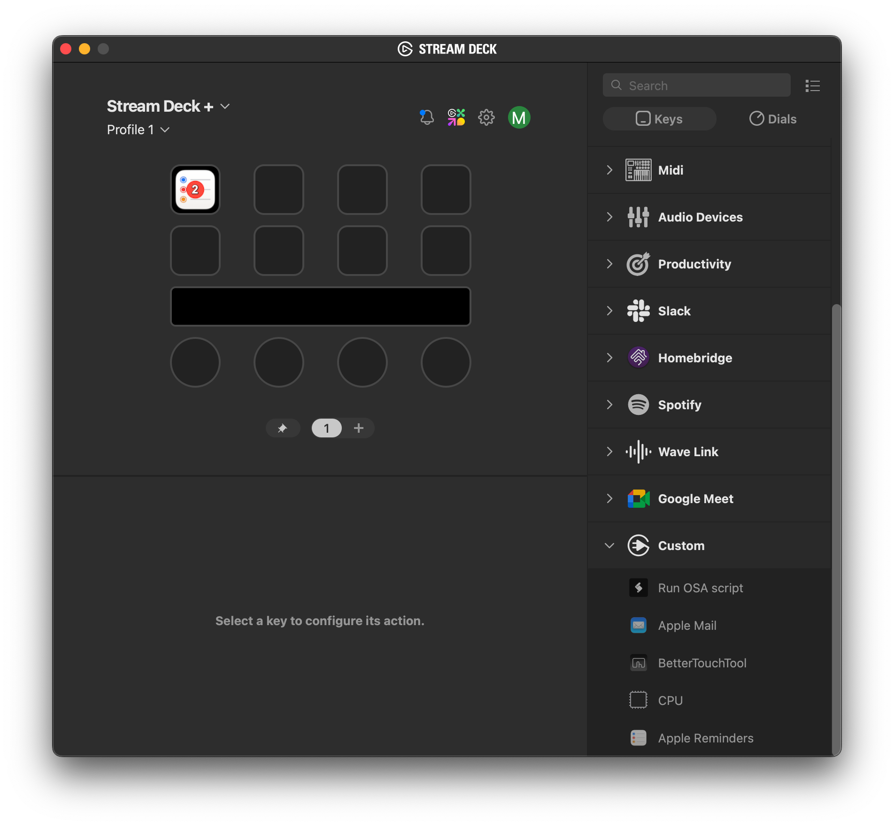

Based on ElGato's [AppleMail](https://github.com/elgatosf/streamdeck-applemail) plugin.

# Description

`AppleReminders` is a plugin that displays the number of unread emails in Apple Mail. Pressing on the key will launch Apple Mail.

# Features

- code written in Objective-C
- macOS only
- localized
- detects if Apple Reminders is running

# Installation

In the Release folder, you can find the file `com.padi04.applereminders`. If you double-click this file on your machine, Stream Deck will install the plugin.

# Source code

The Sources folder contains the source code of the plugin.
